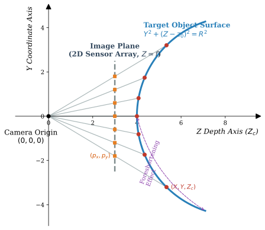

# 菠萝果实测量算法流程

*基于逆圆柱透视校正的表面纹理分析*

本文档对 PineappleHub 菠萝果眼几何参数测量流水线进行严格的数学描述。该流水线将**物理尺度校准**、**表面纹理驱动的感兴趣区域（ROI）选择**以及**双轴圆柱透视校正**相结合，对光照变化、拍摄距离及果实姿态均具有鲁棒性。

## 核心假设

1.  **物理尺度不变性**：以1元硬币（标称直径 25 mm，半径 $R_{coin} = 12.5$ mm）为参照物，通过检测它建立像素–毫米映射 $\rho$（px/mm）。后续所有空间参数均由 $\rho$ 推导得出，无需手工标定。
2.  **成像几何模型**：菠萝被近似为凸圆柱面。透视缩短效应使果实横向边缘的表观宽度与顶底的表观高度均受压缩。需要两次独立的圆柱重投影（见第三步）才能同时修正两个方向的畸变。
3.  **形态学对比度**：菠萝果皮富含高频纹理（各果眼隆起之间有清晰边缘），而切开的果肉表面平滑、亮度接近均匀。这种纹理差异是 ROI 选择的唯一判别依据。

---

## 算法流程

### 第一步：尺度校准与预处理

**目标**：建立物理比例尺 $\rho$（px/mm），抑制传感器噪声，并生成用于后续轮廓分析的二值化表示。

#### 1.1 噪声抑制

对原始亮度图像 $I_{raw}$ 依次进行两步滤波。首先以 $3\times 3$ 中值滤波去除椒盐噪声，不模糊边缘：

$$I_{med} = \text{median}_{3\times 3}(I_{raw})$$

然后应用标准差 $\sigma = 1.0$ 像素的高斯滤波器，在保留结构边缘的同时平滑残余高频传感器噪声：

$$I_{smooth} = I_{med} * G_\sigma$$

#### 1.2 鲁棒轮廓提取

对 $I_{smooth}$ 执行以下共用预处理序列，以获得可靠的形状候选：

1.  **全局 Otsu 阈值化**：选择令类内亮度方差最小的阈值 $\tau^*$：

$$B = \mathbf{1}[I_{smooth} > \tau^*]$$

2.  **形态学闭运算**（半径 2 px，$L_2$ 结构元素）：桥接高光引起的细小空洞：

$$B_{closed} = B \oplus \text{disk}(2) \ominus \text{disk}(2)$$

3.  **形态学开运算**（半径 3 px，$L_2$ 结构元素）：去除细长突起和孤立噪点：

$$B_{open} = B_{closed} \ominus \text{disk}(3) \oplus \text{disk}(3)$$

> 此处选用 $L_2$（欧氏）结构元素以产生各向同性的圆形核，这对硬币检测至关重要——各向异性核会系统性地扭曲圆形度指标 $\kappa$。

4.  **轮廓检测与直线边缘剔除**（`remove_hypotenuse`）：边界包含长直线段（用于指示直尺等矩形物体）的轮廓被丢弃，检测阈值为 5.0 像素。

#### 1.3 尺度校准（硬币检测）

对每个保留的轮廓，在其**凸包**（Convex Hull）上计算三个旋转不变量（凸包修复使污点或细小边缘缺陷引起的凹陷失效）：

- **凸包面积** $A_{hull}$ 及**凸包周长** $P_{hull}$
- **最小外接矩形**（`min_area_rect`）：得到边长 $d_0, d_1$
- **纵横比**：$\alpha = d_{short} / d_{long} \in (0,1]$，在旋转下保持不变，圆形时等于 1.0
- **填充率**：$\phi = A_{hull} / (d_0 \cdot d_1)$，理想圆的填充率 $\phi_{ideal} = \pi/4 \approx 0.785$
- **圆形度**：$\kappa = 4\pi A_{hull} / P_{hull}^2$，完美圆形时等于 1.0

**两级回退检测**：

*第一级（严格）*：选取同时满足以下三个约束且凸包面积最大的候选：

$$\alpha > 0.95, \quad \phi \in [0.70,\,0.88], \quad \kappa > 0.85$$

*第二级（宽松兜底）*：若第一级无结果，则在满足宽松约束（$\alpha > 0.85$，$\phi \in [0.60, 0.92]$，$\kappa > 0.70$）的候选中按惩罚评分排序，选取最优者：

$$s = -\bigl(10\,|\alpha - 1| + 5\,|\phi - \tfrac{\pi}{4}| + 5\,|1 - \kappa|\bigr)$$

**比例尺推导**：以中选凸包面积 $A_{hull}$ 反推等效半径：

$$R_{hull} = \sqrt{A_{hull} / \pi}$$

物理比例尺：

$$\rho = \frac{R_{hull}}{R_{coin}} \quad [\text{px/mm}]$$

---

### 第二步：纹理驱动的 ROI 提取

**目标**：在对半切开的菠萝中判别果皮侧（避开果肉和背景物体），并提取经旋转校正的正立裁剪图，供后续展开步骤使用。

#### 2.1 物理面积过滤

从第1.2节获得的轮廓中，丢弃所有面积低于以下阈值的候选：

$$A_{min} = 0.2 \times \pi R_{coin}^2 \,\rho^2 \quad [\text{px}^2]$$

*依据*：任何显著小于硬币的区域在任何合理拍摄距离下均不可能是有效的果实表面块。

#### 2.2 纹理丰富度评分

对每个保留的候选 $\mathcal{C}_i$，计算**纹理丰富度**评分 $\mathcal{S}_i$，利用果皮表面的高频结构进行区分：

1.  **轴对齐包围盒** $[x_0, x_1) \times [y_0, y_1)$：由候选轮廓的坐标极值计算，并截取到图像边界。

2.  **局部梯度幅值**：对包围盒内每个非背景像素（背景定义为亮度 $\leq 15$），计算一阶有限差分梯度幅值：

$$\nabla I(x,y) = |I(x,y) - I(x+1,y)| + |I(x,y) - I(x,y+1)|$$

3.  **平均边缘密度**：在该区域内 $N_{fg}$ 个非背景像素上取均值：

$$\bar{g}_i = \frac{1}{N_{fg}} \sum_{(x,y) \in \mathcal{C}_i} \nabla I(x,y)$$

4.  **综合评分**（平衡纹理丰富度与区域大小；使用 $\sqrt{A}$ 而非 $A$ 以防止面积完全主导）：

$$\mathcal{S}_i = \bar{g}_i \cdot \sqrt{A_i}$$

综合评分最高的候选 $\mathcal{C}^* = \arg\max_i \mathcal{S}_i$ 被选定为果皮 ROI。

*物理依据*：菠萝果皮布满隆起的果眼，各果眼之间由深色缝隙分隔，产生高 $\bar{g}$。切开的果肉表面光滑，$\bar{g} \approx 0$。硬币虽边缘对比强烈，但面积小，$\sqrt{A}$ 项形成有效的尺寸惩罚。

#### 2.3 旋转 ROI 裁剪

以中选候选的最小外接矩形为基准，设其中心为 $(c_x, c_y)$、正立尺寸为 $(W_{roi}, H_{roi})$（长轴对应高度）、倾斜角为 $\theta_{tilt}$：

1.  以 $(c_x, c_y)$ 为中心构造边长为 $d = \lceil\sqrt{W_{roi}^2 + H_{roi}^2}\rceil$ 的正方形缓冲区（超界处用零填充）。
2.  对缓冲区绕中心点旋转 $-\theta_{tilt}$（双线性插值），使果实长轴对齐竖直方向。
3.  从旋转图像中心精确裁剪 $W_{roi} \times H_{roi}$ 区域。

若存在高分辨率原始图像，上述流程在全分辨率尺度重复一次（坐标乘以缩放因子 $\text{scale} = W_{orig}/W_{preview}$），以保留最大细节用于后续度量计算。

---

### 第三步：几何深度重建与双轴展开

**目标**：消除菠萝凸面曲率引起的透视缩短畸变。算法沿两个正交方向独立应用逆圆柱投影，恢复物理准确的**高度** $\ell_H$、**宽度** $\ell_W$ 以及**体积** $V$。

#### 3.1 逆透视圆柱投影模型

**物理模型**：将菠萝近似为半径为 $r$ 的有限圆柱。针孔相机以焦距 $f$ 从正面成像。横向边缘处的像素受压缩，因为它们成像的是在物理上比中心轴更远的表面点。

**自适应缩放几何**：为使校正强度适合凸面生物体（真实相机焦距通常导致欠校正），模型参数被设置为等于 ROI 裁剪图的像素宽度 $W$：

$$f = W, \qquad r = W, \qquad \omega = W/2$$

其中 $\omega$ 为圆柱在图像平面上的半宽度。

**圆柱参考距离**：

$$z_0 = f - \sqrt{r^2 - \omega^2}$$

**逐列深度恢复**：对目标像素所在列 $x$（中心化坐标 $p_c^x = x - W/2$），通过求解射线–圆柱交叉二次方程得到深度 $z_c$。定义：

$$a = \frac{(p_c^x)^2}{f^2} + 1, \qquad \Delta = 4z_0^2 - 4a(z_0^2 - r^2)$$

若 $\Delta < 0$，射线未击中圆柱，对应目标像素保持黑色。否则：

$$z_c = \frac{2z_0 + \sqrt{\Delta}}{2a}$$

**纹理反投影**：目标像素 $(x, y)$ 对应的源图像坐标为：

$$x_{src} = p_c^x \cdot \frac{z_c}{f} + \frac{W}{2}, \quad y_{src} = p_c^y \cdot \frac{z_c}{f} + \frac{H}{2}$$

其中 $p_c^y = y - H/2$。注意 $z_c$ 仅依赖 $x$，因此逐列预计算可将开销从 O(WH) 次平方根降至 O(W) 次。

源坐标落在 $[0,W)\times[0,H)$ 范围外的像素被丢弃；恰好位于边缘的像素，其$2\times 2$双线性邻域被截取到有效索引，以避免单像素黑边：

$$I_{dst}(x,y) = \text{bilinear}\bigl(I_{src},\, x_{src},\, y_{src}\bigr)$$

#### 3.2 双轴正交展开

单一竖直圆柱模型可校正横向透视缩短，但无法修正顶底两极的纵向曲率。为此，执行两次独立展开：

**竖直展开**（`VERT_UNWRAP`）：对尺寸为 $W_{roi} \times H_{roi}$ 的正立 ROI 裁剪图直接展开：

$$I_{vert} = \texttt{unwrap}(I_{roi}) \qquad [f = r = W_{roi}]$$

该投影拉伸了横向缩短的边缘，恢复了果实的**真实高度**方向。

**水平展开**（`HORIZ_UNWRAP`）：先将 ROI 顺时针旋转 90°（旋转后尺寸为 $H_{roi} \times W_{roi}$），再展开：

$$I_{horiz} = \texttt{unwrap}(\texttt{rot90}(I_{roi})) \qquad [f = r = H_{roi}]$$

旋转后，果实的旋转轴（原先竖直方向）变为图像的水平方向。原先位于顶底的两极重新定位至图像横向两侧。展开器以 $f = r = H_{roi} \geq W_{roi}$ 施加更强的横向拉伸，消除沿果实旋转轴方向的透视缩短：

该投影提供果实**真实宽度**方向的最精确、无畸变数学表示。

#### 3.3 轮廓提取与指标计算

对两幅展开图像分别执行以下流程，提取最小外接几何：

1.  **全局 Otsu 阈值化** → 二值掩膜。
2.  **0.25× 缩小**（最近邻），随后进行形态学闭运算（半径 2，$L_\infty$）再进行开运算（半径 3，$L_\infty$），最后**4× 放大**回原始分辨率。多尺度处理在抑制内部噪声的同时保留了果实整体轮廓。此处选用 $L_\infty$（切比雪夫/方形）结构元素以提高计算效率；在 0.25× 分辨率下，$L_2$ 与 $L_\infty$ 核的差异相对于果实整体轮廓尺度可忽略不计。
3.  按周长选取**最长轮廓**。
4.  对最长轮廓求**最小外接矩形**（`min_area_rect`），得到长轴长 $\ell_{major}$、短轴长 $\ell_{minor}$ 及长轴方向角 $\varphi$。

**尺寸赋值规则**：

| 来源 | 使用量 | 物理含义 |
|:---:|:---:|:---:|
| `VERT_UNWRAP` 矩形 | $\ell_{major}$ | **高度** $\ell_H$ |
| `HORIZ_UNWRAP` 矩形 | $\ell_{minor}$ | **宽度** $\ell_W$ |

#### 3.4 体积积分（圆盘法 + 双视图融合）

体积由 `HORIZ_UNWRAP` 轮廓通过**旋转体圆盘积分法**计算，同时利用 `VERT_UNWRAP` 的长轴长度对轴向坐标进行校正。

##### 坐标分解

将 `HORIZ_UNWRAP` 轮廓点 $\{(x_k, y_k)\}$ 相对于矩形中心 $(c_x, c_y)$ 分解为沿旋转轴（长轴方向角 $\varphi$）的两个正交分量：

- **沿轴坐标**（截面位置）：$t_k = (x_k - c_x)\cos\varphi + (y_k - c_y)\sin\varphi$
- **垂直距离**（截面半径）：$r_k = -(x_k - c_x)\sin\varphi + (y_k - c_y)\cos\varphi$

##### 双视图轴向融合

`HORIZ_UNWRAP` 校正了**宽度方向**的透视缩短，因此 $r_k$ 是准确的截面半径。但其**轴向方向**未经校正，$t_k$ 仍含有透视压缩。为此，利用 `VERT_UNWRAP`（已校正高度方向）的长轴长度 $\ell_{major}^{V}$ 对 $t$ 进行线性重标定：

$$t'_k = t_k \times \frac{\ell_{major}^{V}}{\ell_{major}^{H}}$$

其中 $\ell_{major}^{H}$ 为 `HORIZ_UNWRAP` 矩形的长轴长度。该比值捕获了轴向透视压缩的幅度，将 $t$ 拉伸至与 `VERT_UNWRAP` 一致的物理尺度。

##### 上半轮廓积分

仅保留 $r_k \geq 0$ 的**上半轮廓**用于积分。单条轮廓线即足以定义旋转体；若使用全部轮廓点，按 $t'_k$ 排序后上下两条轮廓交替出现，导致梯形板片在上下轮廓间错误插值。按 $t'_k$ 递增排序后，逐对相邻点以**梯形面积插值**执行圆盘积分：

$$V_{px} = \sum_{k} \pi \frac{r_k^2 + r_{k+1}^2}{2} \Delta t'_k, \qquad \Delta t'_k = t'_{k+1} - t'_k$$

梯形插值假设截面**面积**在相邻采样点间线性变化，相较于取 $\max(r_k, r_{k+1})$ 的外包络近似，更为精确。以双精度浮点数（`f64`）累加以抑制舍入误差，最终转换为物理单位：

$$V = V_{px} \cdot \rho_{hr}^{-3} \quad [\text{mm}^3]$$

其中 $\rho_{hr} = \rho \cdot \text{scale}$ 为高分辨率像素–毫米比。

---

### 第四步：果眼尺寸估算与整果数目推断

**目标**：测量赤道面代表性果眼的几何参数，并估算整个果实的果眼总数。

#### 4.1 赤道面代表性果眼测量

从果皮 ROI 的**赤道区域**选取一枚代表性果眼，提取其几何参数。

##### 分割策略

菠萝果眼呈不规则六边形或菱形，直径与 1 元硬币相仿（约 20–30 mm）。利用这一先验几何约束，采用**严格→逐步放宽**的策略：

1. 对正立果皮 ROI 灰度图做自适应阈值化（块半径由硬币半径推导，δ = 0）。
2. 形态学开运算（先腐蚀后膨胀，$L_\infty$ 范数，半径 2）分离粘连果眼。
3. 连通域标注（4 连通）；按面积过滤（介于 0.2× 至 2.0× 硬币面积之间）。
4. 从边界框与赤道线相交的候选中，对每个候选的最小外接矩形纵横比做三级阈值检验（严格：[0.4, 1.0]，然后 [0.3, 1.0]，再 [0.2, 1.0]）。使用第一个产生候选的级别。
5. 在通过检验的候选中，选取质心最靠近果实纵轴线的一枚。

##### 测量方式

单枚果眼在果皮弧面上所张角度仅约 ±5°–10°，透视缩短量不足 1%。对如此小的 ROI 做逆圆柱展开，插值引入的误差可能反超校正收益。因此果眼级测量**直接**从高分辨率图像读取：

- **长轴** $a_{eq}$ 与**短轴** $b_{eq}$：果眼最小外接矩形的两条边长，通过 $\rho_{hr}$ 换算为 mm。
- **方向角** $\alpha$：果眼长轴与果实纵轴的夹角，归一化至 $[0, \pi/2]$。

#### 4.2 整果表面积（轮廓积分法）

在 `unwrap_metrics.rs` 中与体积同步计算。使用**旋转体侧面积公式**，对同一 `HORIZ_UNWRAP` 上半 $(t, r)$ 轮廓做积分：

$$S = \int 2\pi \, r(t) \sqrt{1 + \left(\frac{dr}{dt}\right)^2} \, dt$$

##### 包络平滑

与体积积分不同，表面积积分对轮廓噪声敏感：弧长元素 $ds = \sqrt{\Delta t^2 + \Delta r^2}$ 会累积像素级锯齿（体积积分中 $\Delta t \approx 0$ 时 $\pi r^2 \Delta t \approx 0$，但表面积积分中同样的锯齿贡献 $2\pi r \cdot |\Delta r| > 0$）。抑制方法：

1. 将 $t$ 轴分为等宽桶，桶宽 $\approx t\_scale$（即未缩放坐标系中 1 像素宽），确保每桶至少包含一个轮廓点。
2. 每桶取 $r$ 的最大值（外包络），得到平滑轮廓 $\hat{r}(t)$。
3. 空桶由相邻非空桶线性插值填充；首/尾空桶用最近有效值填充。

离散积分（梯形法）：

$$S \approx \sum_{i} 2\pi \cdot \frac{\hat{r}_i + \hat{r}_{i+1}}{2} \cdot \sqrt{\Delta t_i^2 + \Delta \hat{r}_i^2}$$

#### 4.3 极区扁平面积扣除

菠萝的顶端和底端各有一个无果眼的扁平区域——**冠芽盘**（顶端）和**果柄盘**（底端）。这些区域的面积需从总表面积中扣除。

**方法**：将 `HORIZ_UNWRAP` 轮廓投影至 $(t, |r|)$ 空间（取绝对值以获取全轮廓半宽）。在两端各取深度为 $a_{eq}/2$ mm（通过 $\rho_{hr}$ 转换为像素）的窗口，取窗口内 $|r|$ 的均值，分别得到两极区半径 $r_{top}$、$r_{bot}$。各极区近似为扁平圆盘：

$$S_{cap} = \pi \cdot r_{top}^2 + \pi \cdot r_{bot}^2$$

> **窗口选择依据**：距果实尖端不足 $a_{eq}/2$（半个果眼高度）处无法完整排列一枚果眼，该区域可安全归为无果眼区。

#### 4.4 单枚果眼占位面积

$$A_{eye} = a_{eq} \times b_{eq}$$

> **为何不使用 $d_v \times d_h$**：$d_v = a_{eq}|\cos\alpha| + b_{eq}|\sin\alpha|$、$d_h = a_{eq}|\sin\alpha| + b_{eq}|\cos\alpha|$ 是将果眼投影至果实纵横轴方向时的**轴对齐包围盒**尺寸，仅在按行列计数时有意义。在表面铺砖法中，每枚果眼的物理占位面积由其自身的外接矩形决定，与其相对于果实轴的朝向无关。当 $\alpha = 0.358\,\text{rad}$ 时，$d_v \times d_h$ 较 $a_{eq} \times b_{eq}$ 膨胀 66%，导致系统性低估。

#### 4.5 整果果眼总数

$$N_{total} = \left\lfloor \frac{S - S_{cap}}{A_{eye}} \right\rfloor = \left\lfloor \frac{S - S_{cap}}{a_{eq} \times b_{eq}} \right\rfloor$$

> 向下取整是因为紧密排列假设忽略了果眼间缝隙，估算值略偏大，向下取整可部分补偿。

---

## 输出指标汇总

| 符号 | 名称 | 单位 | 来源 |
|:---:|:---:|:---:|:---:|
| $\ell_H$ | 物理高度（长轴长） | mm | `VERT_UNWRAP` 长轴 |
| $\ell_W$ | 物理宽度（短轴长） | mm | `HORIZ_UNWRAP` 短轴 |
| $V$ | 真实体积 | mm³ | `HORIZ_UNWRAP` 圆盘积分 |
| $S$ | 表面积 | mm² | `HORIZ_UNWRAP` 包络积分 |
| $a_{eq}$ | 赤道面果眼长轴长 | mm | 果眼最小外接矩形 |
| $b_{eq}$ | 赤道面果眼短轴长 | mm | 果眼最小外接矩形 |
| $\alpha$ | 果眼方向角 | rad | 果眼长轴 vs. 果实纵轴 |
| $N_{total}$ | 整果果眼总数估算 | — | $\lfloor (S - S_{cap}) / (a_{eq} \times b_{eq}) \rfloor$ |

---

## 主要优势

- **物理精确性**：双轴展开策略精确处理了凸面生物体的横向和纵向透视缩短，无需启发式包围盒假设。
- **尺度不变性**：所有空间参数（面积阈值、形态学半径）均由硬币校准推导，在不同拍摄距离下保持一致。
- **纹理判别 ROI 选择**：边缘密度 × √面积评分可靠地将有纹理的果皮与光滑果肉区分开，无需颜色空间假设。
- **计算效率**：逐列预计算深度值将主要开销（平方根运算）从 O(WH) 降至 O(W)。
- **抗噪表面积分**：包络分桶法消除像素级锯齿膨胀，同时保留果实真实轮廓形状。
- **解剖学感知的果眼计数**：极区面积扣除处理了冠芽盘和果柄盘这两处无果眼区域。
